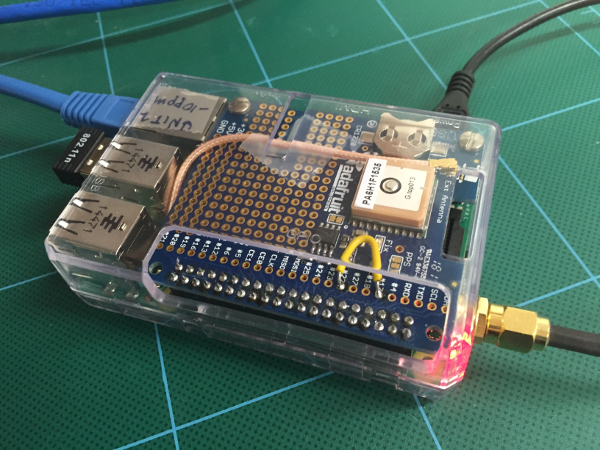
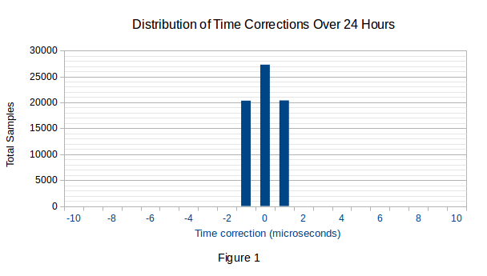
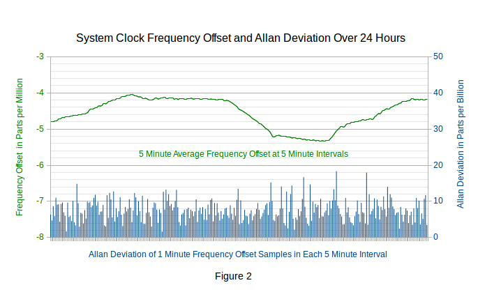
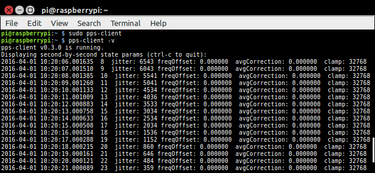
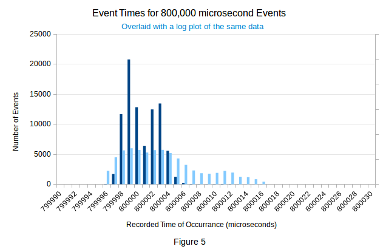

# Raspberry Pi PPS Client

<center></center>

The pps-client daemon is a fast, high accuracy Pulse-Per-Second system clock synchronizer for Raspberry Pi that synchronizes the Raspberry Pi system time clock to a GPS time clock. 

- [Summary](#summary)
- [Hardware Requirements](#hardware-requirements)
- [Software Requirements](#software-requirements)
  - [The Raspian OS](#the-raspian-os)
  - [The NTP daemon](#the-ntp-daemon)
  - [The chkconfig system services manager](#the-chkconfig-system-services-manager)
- [Installing](#installing)
- [Uninstalling](#uninstalling)
- [Reinstalling](#reinstalling)
- [Building from Source](#building-from-source)
  - [Locate the Kernel Source](#locate-the-kernel-source)
    - [Latest Version Source](#latest-version-source)
    - [Earlier Version Source](#earlier-version-source)
  - [Building](#building)
- [Running pps-client](#running-pps-client)
- [Practical Limits to Time Measurement](#practical-limits-to-time-measurement)
  - [Flicker Noise](#flicker-noise)
  - [Linux OS Real-Time Latency](#linux-os-real-time-latency)
  - [Measurements of Noise and Latency](#measurements-of-noise-and-latency)

# Summary
---
The pps-client daemon provides timekeeping synchronization precision of 1 microsecond and a typical average accuracy of 2 microseconds on the Raspberry Pi 3 (verified on 10 test units).

Figure 1 is a distribution of time adjustments made by the pps-client controller to the system clock. 

<center></center>

This data was captured from a Raspberry Pi 3 running Raspian with a 4.4.14-v7+ Linux kernel. The time corrections required to keep the rollover of the second synchronized to the rising edge of the PPS signal never exceeded 1 microsecond in this 24 hour period. This was true for all test units.

Figure 2 shows the system clock frequency set by the controller and the resulting [Allan deviation](https://en.wikipedia.org/wiki/Allan_variance) for the test unit with the largest error of the ten that were tested.

<center></center>

Although the clock frequency drifted slightly between each frequency correction, the maximum Allan deviation of 0.045 ppm over this 24 hour period shows it to be unlikely that the clock ever drifted more than 0.100 ppm from the control point. That corresponds to a time drift of less than 0.1 microseconds per second (A clock offset of 1 ppm corresponds to a time drift of 1 microsecond per sec.)

Since the time slew adjustments necessary to keep the system time synchronized to the PPS never exceeded 1 microsecond each second and the time drift never exceeded 0.1 microsecond each second, the timekeeping control **precision** illustrated in Figure 3 was 1 microsecond over this 24 hour period for all test units. 

As shown in Figure 3, timekeeping **accuracy** is the time offset at the rollover of the second which is also the offset between the true time and the measured time at any point in time.

<center></center>

Figure 4 is the distribution of measured times relative to a true time of 800,000 microseconds into each second for a typical Raspberry Pi 3 from the units tested.

<center></center>

The peak of the distribution in Figure 4 is the average error for this test unit and is about 0.28 microsecond below 800,000 microseconds. For the ten test units the median error was -0.25 microsecond and the maximum error was -0.76 microseconds. 

Figure 4 also shows that there are limits to accurate single-event time measurement set by clock oscillator jitter and the response time (latency) of the Linux kernel. This is discussed below in [Practical Limits to Time Measurement](#practical-limits-to-time-measurement).

For a detailed description of the pps-client controller and accuracy testing run Doxygen to generate the documentation or visit the [PPS-Client-Pages](https://rascol.github.io/Raspberry-Pi-PPS-Client) website.

# Hardware Requirements
---

1. A Raspberry Pi 3 or Pi 2 Model B.

2. A GPS module that provides a PPS output. Development was done with the [Adafruit Ultimate GPS module](http://www.adafruit.com/product/746). Others providing compatible logic levels can also be used.

3. A wired connection from a PPS source with 3.3 Volt logic outputs to GPIO 4 (pin 7) on the RPi header.

4. A wired connection from GPIO_17 (pin 11) to GPIO_22 (pin 15) to support self calibration (Note the yellow jumper in the photo above).
 
# Software Requirements
---
## The Raspian OS

Versions of Linux kernel 4.1 and later are supported. The Raspian OS is required only because the RPi file locations required by the installer (and test files) are hard coded. If there is enough interest in using alternative OS's, these install locations could be determined by the pps-client config file.

## The NTP daemon

NTP is provided out the box on Raspian. NTP sets the whole seconds of the initial date and time and SNTP maintains the date and time through DST and leap second changes.

## The chkconfig system services manager 
 
`$ sudo apt-get install chkconfig`

This is necessary if you want to install pps-client as a system service.

# Installing
---

The pps-client program has a built-in Linux kernel driver. It is a Linux requirement that kernel drivers must be compiled on the Linux version on which they are used. This means that there is a different version of PPS-Client for every version of Linux that has been released since Linux 4.0 ! Since there have been more than one hundred of these, it is impractical to provide a pre-compiled pps-client installer for every one.

So this is our compromise: A few pre-compiled installers are provided on the server for the most current stable versions of Linux. However, instructions for [installing from source](#building-from-source) for any version of Linux 4 are also provided below.

One possibility is to download and install a fresh copy of [Raspian](https://www.raspberrypi.org/downloads/raspbian/) and use the pps-client installer from our website to try out pps-client. Then later install pps-client from source for earlier an version of Linux.

To install pps-client on a fresh Raspian, open a terminal to your Raspberry Pi. Then if you haven't already done so,
```
$ sudo apt-get update
$ sudo apt-get upgrade
$ sudo reboot
```
After rebooting check the Linux version:
```
$ uname -r
$ 4.4.26-v7+
```
That Linux version must match the installer version on our website. Now copy the installer and run it:
```
$ wget "https://github.com/rascol/Raspberry-Pi-PPS-Client/pps-client-4.4.26-v7+"
$ sudo ./pps-client-4.4.26-v7+
```
This is not an ideal installation solution because it means that pps-client has to be re-installed if the Linux kernel is upgraded. But that will not automatically happen unless you run `rpi-update`. If there is enough interest in this project, the driver may be accepted into mainline in the upstream kernel and the versioning problem will go away.

# Uninstalling
---

Uninstall pps-client on the RPi with:
```
$ sudo pps-client-stop
$ sudo pps-client-remove
```
This removes everything **except** the configuration file which you might want to keep if it has been modified and you intend to reinstall pps-client. To remove everything do:

```
$ sudo pps-client-remove -a
```

# Reinstalling
---

To reinstall, first uninstall as [described above](#uninstalling) then install.

# Building from Source
---
The pps-client contains a Linux kernel driver. Consequently, as with all kernel drivers, building pps-client requires that a compiled Linux kernel with the same version as the version present on the RPi must also be available when pps-client is compiled. This is a two step process. First the appropriate Linux kernel source is downloaded and compiled. Then the pps-client project is compiled with access to the compiled kernel object files. 

In principle that can be done on a cross-compiler. However building on the Raspberry Pi is better because if the source code of the released Linux kernel has problems, a fallback is available to the Pi that is not available to a cross-compiler: Once the Linux team has recognized that there were problems, `apt-get upgrade` will automatically revert the OS to a previous known good kernel that matches the downloaded source code (which the Linux team will also have reverted to the known good kernel).

The steps below don't do a complete kernel installation. Only enough is done to get the object files that are necessary for compiling a kernel driver. The complete installation takes about 40 minutes on Raspberry Pi 3.

## Locate the Kernel Source

Before attempting to compile the kernel be certain your system and tools are up to date on the Raspberry Pi. The reboot is necessary in case Linux was reverted to an earlier version. That could happen if the Linux team detected problems with the later version:
```
$ sudo apt-get update
$ sudo apt-get upgrade
$ sudo reboot
```
After reboot determine the Linux kernel version on the Raspberry Pi by running `uname -r` from a connected terminal. Then from a web browser go to https://github.com/raspberrypi/linux. Scroll down the page and examine the `Makefile` line. That line will contain the version number of the latest Linux version (for example `Linux 4.4.21`). For the moment, ignore the **third** number. If the **first two** numbers of the version are the same as the first two numbers of the kernel version running on your RPi, it is running the latest kernel (Linux 4.4). 

In that case, use the procedure in section [Latest Version Source](#latest-version-source) to retrieve the kernel source that you need. Otherwise you will need to use the procedure given in the section [Earlier Version Source](#earlier-version-source) to retrieve the required kernel.

### Latest Version Source

Chances are, as indicated by the **third** number in the kernel version on your RPi, the RPi kernel is earlier than the latest Linux bugfix version. You can find the kernel source that you need by browsing to https://github.com/raspberrypi/linux/commits/rpi-4.4.y (assuming that `Linux 4.4` is the latest kernel). 

That page lists all of the commits made for `Linux 4.4`. Scroll down the page (clicking the `Older` button at the bottom of the page as necessary) until you find the version commit line for the version that matches your installed RPi kernel (listed as `Linux 4.4.19` for example). Click on `Linux 4.4.19`. That will take you to the commit page. Now click on the `Browse files` button on the right in the title line. That will take you to the source page that you need in the build steps below.

### Earlier Version Source

From a browser go to, for example, https://github.com/raspberrypi/linux/commits/rpi-4.1.y (the **second** number must agree with your Linux kernel version). Scroll down the page (clicking the `Older` button at the bottom of the page as necessary) until you find the version commit line for the version that matches the installed kernel on your RPi (listed as `Linux 4.1.19` for example). Click on `Linux 4.1.19`. That will take you to the commit page. Now click on the `Browse files` button on the right in the title line. That will take you to the source page that you need in the build steps below.

It is possible that you might not be able to locate the kernel version that you need. In this case you could update your RPi to the latest bugfix kernel (`Linux 4.1.21` in this example). Bugfix updates are intended to only make changes that will not break existing code. But, there are no guarantees. If you later run into a problem, the kernel you replaced has been saved on your RPi so you can always revert to it.

To update your RPi kernel you will need to use the `rpi-update` utility. If necessary install it with `sudo apt-get install rpi-update`.

Then update to the latest bugfix for your kernel version (in this example `Linux 4.1`) with
```
$ sudo BRANCH=rpi-4.1.y rpi-update
```
Now browse back to  https://github.com/raspberrypi/linux/commits/rpi-4.1.y and click on the Linux commit entry (`Linux 4.1.21` was the latest). That will take you to the latest commit page for `Linux 4.1`. Click on the `Browse files` button on the right in the title. That will take you to the source page you need in the build steps below.

## Building

You might want to create a folder to hold the kernel and pps-client project. For example,
```
$ mkdir ~/rpi
$ cd ~/rpi
```
Assuming that you are on a workstation or Raspberry Pi that has an open terminal to the RPi and also have the [kernel sources page](#locate-the-kernel-source) open in a web browser, click on the green `Clone or download` button on the right side of the browser page. That will open an entry box. Hover over the `Download ZIP` box at the bottom of the entry box, right click on it and select `Copy link address`. Paste that address onto the command line of the RPi terminal. Surround it with quotes and prefix it with `wget` as in this example:
```
$ wget "https://github.com/raspberrypi/linux/archive/887b692a469f9a9a666654e607103f5204ac5eb7.zip"
```
Execute the command and wait a few minutes for the download to complete.

Now unzip the download.
```
$ unzip -q 887b692a469f9a9a666654e607103f5204ac5eb7.zip
```
Wait a few more minutes for it to unzip then rename it to `linux`:
```
$ mv linux-887b692a469f9a9a666654e607103f5204ac5eb7 linux
```
Get missing dependencies:
```
$ sudo apt-get install bc
```
Configure the kernel:
```
$ cd ~/rpi/linux
$ KERNEL=kernel7
$ make bcm2709_defconfig
```
Now compile the kernel (takes about half an hour on Pi 2, 20 minutes on Pi 3):
```
$ make -j4 zImage
```
If there are no compile errors, the last message from the compiler will be,
```
$ Kernel: arch/arm/boot/zImage is ready
```
If there are errors and you need to recompile be sure to first clean the Linux folders with,
```
$ make mrproper
```
If all went well, you have the necessary kernel object files to build the pps-client driver. If you have not already downloaded the pps-client project, do it now:
```
$ cd ..
$ git clone --depth=1 https://github.com/rascol/Raspberry-Pi-PPS-Client
$ cd PPS-Client
```
Now make the pps-client project. The `KERNELDIR` argument must point to the folder containing the compiled Linux kernel. Type or copy the commands below exactly as shown (using **back quotes** which cause the back quotes and text between to be replaced with the correct kernel version).
```
$ make KERNELDIR=~/rpi/linux KERNELVERS=`uname -r`
```
That will build the installer. Run it on the RPi as root:
```
$ sudo ./pps-client-`uname -r`
```
That completes the pps-client installation.

# Running pps-client
---

The pps-client requires that a PPS hardware signal is available from a GPS module and all wired connections for the GPS module [are in place](#hardware-requirements). Once the GPS is connected and the PPS output is present on GPIO 4 you can do a quick try-out with,
```
$ sudo pps-client
```
That installs pps-client as a daemon. To watch the controller acquire you can subsequently enter
```
$ pps-client -v
```
That runs a secondary copy of pps-client that just displays a status printout that the pps-client daemon continuously generates and saves to a memory file. When pps-client starts up you can expect to see something like the following in the status printout:

<center></center>

The `jitter` value is showing the fractional second offset of the PPS signal according to the system clock. That value will decrease second by second as the controller locks to the PPS signal. After about 10 minutes the status printout will look like this:

<center></center>

The `jitter` is displaying small numbers. The time of the rising edge of the PPS signal is shown in the second column. The `clamp` value on the far right indicates that the maximum time correction applied to the system clock is being limited to one microsecond. The system clock is synchronized to the PPS signal to a precision of one microsecond (but with an absolute accuracy limited by clock oscillator noise which could have as much as 1 microsecond of [RMS](https://en.wikipedia.org/wiki/Root_mean_square) jitter).

It can take as long as 20 minutes for pps-client to fully acquire the first time it runs. This happens if the `jitter` shown in the status printout is on the order of 100,000 microseconds or more. It's quite common for the NTP fractional second to be off by that amount on a cold start. In this case pps-client may restart several times as it slowly reduces the `jitter` offset. That happens because system functions that pps-client calls internally prevent time changes of more than about 500 microseconds in each second.

These are the parameters shown in the status printout:

 * First two columns - date and time of the rising edge of the PPS signal.
 * Third column - the sequence count, i.e., the total number of PPS interrupts received since pps-client was started.
 * jitter - the time deviation in microseconds recorded at the reception of the PPS interrupt.
 * freqOffset - the frequency offset of the system clock in parts per million of the system clock frequency.
 * avgCorrection - the time corrections (in microseconds) averaged over the previous minute.
 * clamp - the hard limit (in microsecs) applied to the raw time error to convert it to a time correction.

Every sixth line, interrupt delay parameters are also shown. About every 17 minutes, an SNTP time query will be made and the results of that will be shown, but will have no effect unless a time update is required.

To stop the display type ctrl-c.

The daemon will continue to run until you reboot the system or until you stop the daemon with
```
$ sudo pps-client-stop
```

To have the pps-client daemon be installed as a system service and loaded on system boot, from an RPi terminal enter:
```
$ sudo chkconfig --add pps-client
```
If you have installed pps-client as a system service you should start it with 
```
$ sudo service pps-client start
```
and you should stop it with
```
$ sudo service pps-client stop
```
The "`pps-client -v`" command continues to work as described above.

# Practical Limits to Time Measurement
---

While pps-client will synchronize the system clock to a GPS clock with an average accuracy of two microseconds, there are practical limits imposed by the hardware and the operating system that limit single-event timing accuracy. The hardware limit is [flicker noise](https://en.wikipedia.org/wiki/Flicker_noise), a kind of low frequency noise that is present in all crystal oscillators. The operating system limit is the real-time performance of the Linux OS.

## Flicker Noise

The Raspberry Pi is an ARM processor that generates all internal timing with a conventional integrated circuit oscillator timed by an external crystal. Consequently the RPi is subject to crystal oscillator flicker noise. In the case of the RPi, flicker noise appears as a random deviation of system time from the PPS signal of up to a few microseconds. Even though flicker noise is always present, it is not evident when timing intervals between events occurring in software running on the same system. It only becomes evident when timing events external to the processor or between two systems. 

Flicker noise sets the absolute limit on the accuracy of the system clock. This is true not only of the RPi ARM processor but also of all conventional application processors.

## Linux OS Real-Time Latency

The Linux OS was never designed to be a real-time operating system. Nevertheless, because of considerable interest in upgrading it to provide real-time performance, real-time performance improved significantly between versions 3 and 4. As a result, median system latency in responding to an external interrupt on the RPi ARM processor is currently about 6 microseconds - down from about 23 microseconds in Linux 3. As yet, however, longer sporadic delays still occur. 

## Measurements of Noise and Latency

<center></center>

Figure 5 is a typical accumulation of single-event timings for external interrupts at 800,000 microseconds after the PPS interrupt. The main peak is the result of reasonably constant system latency and clock oscillator flicker noise having a standard deviation of about 0.8 microsecond. The secondary peak at about 800,003 microseconds is one of many such features introduced by OS latency that can appear for hours or days or disappear altogether. The jitter samples to the right of the main peak that can only be seen in the logarithmic plot were delayed time samples of the PPS signal also introduced by OS latency.

Consequently, while flicker noise limits synchronization accuracy of events on different Raspberry Pi computers timed by the system click to a few microseconds (~1 μsec SD), the real-time performance of the Linux OS (as of v4.4.14-v7+) sets the timing accuracy of external events to about 20 microseconds (Pi 3) because of sporadic system interrupt latency.

