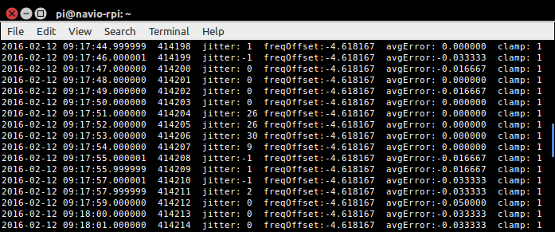

# Raspberry Pi PPS Client

A fast, high accuracy Pulse-Per-Second system clock synchronizer for Raspberry Pi 2.

<center></center>

This daemon synchronizes the Raspberry Pi 2 system clock to a Pulse-Per-Second (PPS) source such as the PPS available from a GPS module with a precision of 1 micosecond and a timekeeping accuracy of 5 microseconds by design. 

<!-- START doctoc generated TOC please keep comment here to allow auto update -->
<!-- DON'T EDIT THIS SECTION, INSTEAD RE-RUN doctoc TO UPDATE -->

- [Hardware Requirements](#hardware-requirements)
- [Software Requirements](#software-requirements)
  - [The NTP daemon](#the-ntp-daemon)
  - [The chkconfig system services manager](#the-chkconfig-system-services-manager)
- [Installing](#installing)
- [Uninstalling](#uninstalling)
- [Reinstalling](#reinstalling)
- [Building from Source](#building-from-source)
  - [Building the RPi Kernel on a Linux Workstation](#building-the-rpi-kernel-on-a-linux-workstation)
  - [Building the RPi Kernel on the RPi](#building-the-rpi-kernel-on-the-rpi)
  - [Building pps-client](#building-pps-client)
- [Operation](#operation)
- [Performance](#performance)
- [Achieving High Timekeeping Accuracy](#achieving-high-timekeeping-accuracy)
- [Controller Software Details](#controller-software-details)
  - [The Feedback Controller](#the-feedback-controller)
  - [The Feedforward Compensator](#the-feedforward-compensator)
  - [Controller Behavior on Startup](#controller-behavior-on-startup)
  - [Performance Under Stress](#performance-under-stress)
- [Error Handling](#error-handling)
- [Uses](#uses)
  - [Time Synchronizing Clusters of Computers](#time-synchronizing-clusters-of-computers)
  - [Using the Raspberry Pi as a Stratum 1 NTP Server](#using-the-raspberry-pi-as-a-stratum-1-ntp-server)

<!-- END doctoc generated TOC please keep comment here to allow auto update -->

# Hardware Requirements
---

1. A Raspberry Pi 2 Model B or later.

2. A GPS module that provides a PPS output. Development was done with the [Adafruit Ultimate GPS module](http://www.adafruit.com/product/746). Others providing compatible logic levels will also work.

3. A wired connection from a PPS source with 3.3 Volt logic outputs to GPIO 4 (pin 7) on the RPi header.

4. A wired connection from GPIO_17 (pin 11) to GPIO_22 (pin 15) to support self calibration (Note the yellow jumper in the photo above).
 
# Software Requirements
---
## The Raspian OS

Version 3.18.9-rt5 and later versions of Linux kernel 4.1.y are supported. Initial development was done with the [EMLID Navio kernel](http://docs.emlid.com/Downloads/Real-time-Linux-RPi2/) because it had real-time patches that were necessay for Linux 3.18.x. The stock 4.1.y kernel now provides equal or better timekeeping performance. 

## The NTP daemon

NTP is provided out the box on Raspian. NTP sets the whole seconds of the initial date and time and SNTP maintains the date and time through DST and leap second changes.

## The chkconfig system services manager 
 
`$ sudo apt-get install chkconfig`

This is necessary if you want to install pps-client as a system service.

# Installing
---

The pps-client has several versions of the installer. Copy the appropriate one to the RPi and run it from a terminal:
```
$ sudo ./pps-client-4.1.20-v7+
```
The pps-client version must match the version of the Linux kernel on the RPi. The kernel version can be determined by running "`uname -r`" on an RPi terminal. Version matching is necessary because pps-client contains a kernel driver and all kernel drivers are compiled against a specific version of the Linux kernel and can only run on that kernel version.

A few different Linux kernels are currently supported and more will be. This is not the best solution because it means that pps-client has to be re-installed every time Raspian updates the kernel version. The hope is that if there is enough interest in this project, the driver will be accepted into mainline in the upstream kernel.

# Uninstalling
---

Uninstall pps-client on the RPi with:
```
$ sudo pps-client-remove
```
Uninstalling isn't necessary if you are installing over an older version of pps-client.

# Reinstalling
---

If you want to keep your current pps-client configuration file rename it before you perform a subsequent install of pps-client. Otherwise it will be overwritten with the default. Something like,

$ sudo mv /ect/pps-client.conf /etc/pps-client.conf.orig

and then, after installing pps-client,

$ sudo mv /etc/pps-client.conf.orig  /ect/pps-client.conf

will preserve your current configuration.

# Building from Source
---
Because pps-client contains a Linux kernel driver, building pps-client involves more than just compiling it. A compiled Linux kernel with the same version as the version present on the RPi must also be available during the compilation of pps-client which can be built on either a Linux workstation (preferred) or directly on the RPi (slower). In either case you will first need to download and compile the Linux kernel that corresponds to the kernel version on your RPi. 

The steps below don't do a complete kernel installation. Only enough is done to get the object files that are necessary for compiling a kernel driver. If you are unable to match your kernel version to the source found [here](https://github.com/raspberrypi/linux) instructions for doing a complete kernel install can be found [here](https://www.raspberrypi.org/documentation/linux/kernel/building.md). Otherwise follow the steps below.

If you need to install git:
```
$ sudo apt-get install git
```

## Building on a Linux Workstation

You might want to create a folder to hold the kernel and tools. For example,
```
$ mkdir ~/rpi
$ cd ~/rpi
```
On a workstation you will need the cross-compiler:
```
$ git clone https://github.com/raspberrypi/tools
```
That should create a "tools" folder in "rpi".

Download the current version of the kernel sources:
```
$ git clone --depth=1 https://github.com/raspberrypi/linux
```
This environment variable will be needed both to configure the kernel and to build pps-client:
```
$ export CROSS_COMPILE=~/rpi/tools/arm-bcm2708/gcc-linaro-arm-linux-gnueabihf-raspbian-x64/bin/arm-linux-gnueabihf-
```
The `export` command above is temporary. It will survive only until you close the terminal window. To make it persistent you can optionally add the `export` command to the `.bashrc` file in your home directory.

Now configure the kernel:
```
$ cd linux
$ KERNEL=kernel7
$ make ARCH=arm CROSS_COMPILE=$CROSS_COMPILE bcm2709_defconfig
```
and compile it:
```
$ make -j6 ARCH=arm CROSS_COMPILE=$CROSS_COMPILE zImage
```
That will provide the necessary kernel object files to build the driver. If you have not already downloaded the pps-client project, do it now:
```
$ cd ~/rpi
$ git clone --depth=1 https://github.com/rascol/PPS-Client
$ cd PPS-Client
```
Now (assuming that the kernel source version is 4.1.20) make the pps-client project. The `KERNELDIR` argument must point to the folder containing the compiled Linux kernel. If not, change it to point to the correct location of the "linux" folder.
```
$ make CROSS_COMPILE=$CROSS_COMPILE KERNELDIR=~/rpi/linux KERNELVERS=4.1.20-v7+
```
That will build the installer, `pps-client-4.1.20-v7+`. Copy this to the RPi. Run it on the RPi as root:
```
$ sudo ./pps-client-4.1.20-v7+
```
That completes the pps-client installation.

## Building on the RPi

You might want to create a folder to hold the kernel and pps-client project. For example,
```
$ mkdir ~/rpi
$ cd ~/rpi
```
Download the current version of the kernel sources:
```
$ git clone --depth=1 https://github.com/raspberrypi/linux
```
Get missing dependencies:
```
$ sudo apt-get install bc
```
Configure the kernel:
```
$ cd linux
$ KERNEL=kernel7
$ make bcm2709_defconfig
```
Compile the kernel (takes about half an hour):
```
$ make -j4 zImage
```
That will provide the necessary kernel object files to build the pps-client driver. If you have not already downloaded the pps-client project, do it now:
```
$ cd ..
$ git clone --depth=1 https://github.com/rascol/PPS-Client
$ cd PPS-Client
```
Now (assuming that the kernel source version is 4.1.20) make the pps-client project. The `KERNELDIR` argument must point to the folder containing the compiled Linux kernel. If not, change it to point to the correct location of the "linux" folder.
```
$ make KERNELDIR=~/rpi/linux KERNELVERS=4.1.20-v7+
```
That will build the installer, `pps-client-4.1.20-v7+`. Run it on the RPi as root:
```
$ sudo ./pps-client-4.1.20-v7+
```
That completes the pps-client installation.

# Operation
---

The pps-client requires that a PPS hardware signal is available from a GPS module. Once the GPS is connected and the PPS output is present on GPIO 4 you can do a quick try-out with,
```
$ sudo pps-client
```
That installs pps-client as a daemon. To watch the controller acquire you can subsequently enter
```
$ pps-client -v
```
That runs a secondary copy of pps-client that does nothing more than display the tracking parameters that the pps-client daemon saves to a temporary file. See the notes at the top of the `pps-client.cpp` source file for a description of these parameters. It may take as long as 10 to 20 minutes for pps-client to fully acquire the first time it runs. This happens if the jitter value shown in the tracking display is on the order of 100,000 microseconds or more. It's quite common for the NTP fractional second to be off by that amount. In this case pps-client may restart several times as it slowly reduces this value. That happens because system functions that pps-client calls internally prevent changes of more than about 500 microseconds in each second.

To stop the display type ctrl-c.

The daemon will continue to run until you reboot the system or until you stop the daemon with
```
$ sudo pps-client-stop
```

To have the pps-client daemon be installed as a system service and loaded on system boot, from the RPi command line enter:
```
$ sudo chkconfig --add pps-client
```
If you have installed pps-client as a system service you should start it with 
```
$ sudo service pps-client start
```
and you should stop it with
```
$ sudo service pps-client stop
```
The `pps-client -v` command continues to work as described above.

# Performance
---
Figure 1 is a distribution of the corrections (dark blue) made by pps-client to the system time of an RPi 2 over a 24 hour period and continuously accumulated in the file `/var/local/error-distrib` when `error-distrib=enable` was set in the pps-client configuration file. These time corrections are superimposed on jitter values (light blue) accumulated over the same period and stored in the file, `/var/local/jitter-distrib`, with `jitter-distrib=enable` set in the config. 

Jitter is the variation in the PPS delay reported to the controller by its kernel driver. After being cleaned up by the pps-client controller, corrections to the time never exceeded one microsecond in any second over this particular 24 hour period. This establishes that the system time is being maintained with a precision of 1 microsecond over this 24 hour period. Also, taking into account other system offsets and uncertainties, absolute time accuracy is within 5 microseconds.


Figure 2 shows the frequency offset of the system clock over the same 24 hour period. Frequency offset is the value, in parts per million of the uncorrected clock frequency, to which the system clock is adjusted in order to keep it continuously synchronized to the PPS signal. In the pps-client controller, it is the frequency offset that keeps the clock continuously synchronized to within 1 microsecond of the PPS rising edge. Also plotted is the Allan deviation of 1 minute samples in each 5 minute interval. This figure is a graph of data continuously accumulated in a 24 hour circular buffer and written to `/var/local/frequency-vars` at five minute intervals when `frequency-vars=enable` was set in the pps-client configuration file.

The frequency offset is compensating for ambient temperature and temperature changes caused by processor activity. Because the frequency offset is set by the pps-client controller, the frequency offset has noise that is introduced by jitter. But as the figure shows, the frequency noise indicated by the Allan deviation will only rarely exceed 20 parts per billion of the system clock oscillator frequency. That would result in a time drift rarely exceeding about 1.2 microseconds per minute. Consequently, not only is the system time error within 1 microsecond at the PPS edge but it is also within 1 microsecond at all times between PPS edges.


# Achieving High Timekeeping Accuracy
---

The pps-client is implemented as a [proportional-integral (PI) controller](https://en.wikipedia.org/wiki/PID_controller) (a.k.a. a Type 2 Servo) with proportional and integral feedback provided each second but with the value of the integral feedback adjusted once per minute. The PI controller model provides a view of time synchronization as a linear feedback system in which gain coefficients can be adjusted to provide a good compromise among stability, transient response and amount of noise introduced by the error signal. 

The error signal is the time difference between the one-second interval provided by a PPS signal and the length of the second reported by the system clock. The noise of concern is the second-to-second variation in time reported by the system because of the corresponding variation of system delay in responding to the PPS interrupt. This variable component of the delay, referred to as jitter, is primarily a consequence of the interrupt contending for processor attention with dozens of other randomly occurring system processes all going on at the same time. But jitter can also be present in the PPS signal generating the interrupt.

Because the error signal has jitter and is being used to control synchronization, the jitter component has the effect of a false error signal that causes the time and frequency synchronization to fluctuate as the controller attempts to follow the jitter. The conventional approach to reducing jitter is to low-pass or median filter the error signal. But filtering has the serious disadvantage that reduction of the jitter must be traded off against time delay introduced by the filter. Additional time delay inevitably degrades control performance. The pps-client program uses a much better technique that introduces no delay. To reduce the jitter, the time values returned by the system are passed through a hard limiter that clips extreme values before applying them as time corrections.

In fact, the individual time corrections constitute jitter added to a very small time correction. Consequently, each individual correction is mostly random noise and thus is wrong by nearly the amount it deviates from zero. Because of that, the limiting employed in this system clips the maximum time corrections when the controller has fully stabilized to the resolution of the time reported by the system which is 1 microsecond.

It might seem that such extreme limiting would remove the desired error signal along with the noise. But that doesn't happen because the true time error is a slowly varying quasi-stationary (DC) level. Limiting only squashes the dynamic (AC) component of the error signal (To see exactly what limiting does see Figures 3, 4, and 5 and the relevant discussion). The DC component remains. If the jitter were not limited, the controller would make the sum of the positive and negative jitter zero. That would be undesirable even after filtering because the noise has significant components in time periods that extend to well beyond one minute. Filtering would remove noise only for time intervals within the cut-off region of the filter. Longer period noise would remain. 

On the other hand, instead of zeroing the sum of negative and positive jitter and thereby allowing the difference to be introduced as noise, once the controller has acquired, hard limiting causes the controller to make the number of positive and negative excursions to be equal around zero. That happens because the clipped positive and negative amplitudes are identical (1 microsecond). Thus, making the sum zero makes the count equal. As a result, the varying magnitude of the jitter around the control point is ignored and the reported time delay of the PPS rising edge adjusts to its median value: the delay value at which there were as many shorter as longer reported delays over the previous minute.

The only (almost insignificant) disadvantage of hard limiting is that it reduces the amount of time correction that can be applied each each second. But that limitation is easily circumvented by allowing the hard limit level to track the amount of required time correction. This insures that the hard limit level does not prevent larger time corrections when they are necessary.

As described, hard limiting removes the error that would be introduced by the magnitude of jitter around the control point. However noise that is outside the control region of the controller, that is, noise with a period appreciably longer than one minute would remain. The time delay corresponding to PPS interrupt latency contains noise of that kind which appears as a slow variation in the latency which tends to increase with processor activity. This latency is compensated in pps-client by a variable called `sysDelay`. The `sysDelay` value directly determines the control point of the controller because the time of the rollover of the second is determined as the reported time of the interrupt minus the value of `sysDelay`.

In order to characterize `sysDelay`, measurements of interrupt latency were made by timing the triggering of the hardware interrupt from a GPIO pin tied across to the GPIO pin that requested the interrupt. Those measurements revealed that interrupt latency has three distinct components: (1) a constant component corresponding to the minimum time required to process the interrupt interrupt request, (2) a uniform random component and (3) an intermittently occurring random component characterized by short bursts of long duration PPS interrupt delay that usually subside within a few seconds.

The constant and uniform random components of interrupt latency are removed from pps-client by incorporating the interrupt latency measurement into the RPi hardware. The pps-client driver that records the reception time of a PPS interrupt also has the ability to measure the initiation and reception times of a test interrupt triggered across a pair of GPIO pins. The time difference in those is used to determine the PPS interrupt latency for a particular RPi 2 and Linux kernel. The median of the latency measurement then becomes the applied `sysDelay` value. This nearly cancels the median of the actual delay from the PPS rising edge generated by the hard limiting in the controller.

Removing jitter bursts, however, requires a different technique. A typical jitter burst is evident in the pps-client tracking display shown below which shows low jitter values except during the burst occurring in the four lines in the center. 



Jitter bursts vary in rate of occurrence and duration and are the result of sporadic activity in the processes currently running on the system. But since they are easily identified by the amount of delay, they can be removed by suspending controller time and frequency updates as long as delay duration exceeds a time value that distinguishes between random noise and a jitter burst. This is the technique used to remove burst noise in the controller. The frequency stability provided by the controller makes it possible to suspend updates for several seconds, without a measurable effect, while waiting for a jitter burst to subside.

# Controller Software Details
---
The discussion below refers to the source code in the `pps-client.cpp` file. Comments in the source file expand on what is discussed here. Identifiers displayed in text script correspond to those in the source file.

## The Feedback Controller

The pps-client controller algorithm processes timestamps of interrupts from a hardware GPIO pin triggered by the rising edges of a PPS signal. These PPS timestamps are recorded by a kernel driver, `pps-client.ko`, that was specifically designed to record the times as closely as possible to when the processor responded to the PPS interrupts. This is important because the time at which the interrupt is recorded minus the time at which it actually toggled the input pin is the interrupt delay that must be compensated by `sysDelay` and this delay should be as short as possible in order to reduce the uncertainty of the delay value.

The `makeTimeCorrection()` routine is the central controller routine and it waits in the timer loop, `waitForPPS()` inside the `readPPS_SetTime()` routine, until a PPS timestamp becomes available. At that instant the timestamp is passed into `makeTimeCorrection()` where it becomes available as the variable `interruptTime` which is converted to the controller error variable as,
```
	rawError = interruptTime - sysDelay
```
Each `rawError` is a time correction corrupted by jitter. Thus the value of `rawError` generated each second can be significantly different from the required time correction. To extract the time correction, `rawError` is passed into the `removeNoise()` routine which first determines (when `rawError` is sufficiently small) is it burst noise? in which case further processing in the current second is skipped. If it's not burst noise, the average time slew, `avgSlew` is updated by `rawError`. The `avgSlew` value along with the average time correction up to the current second, `avgCorrection`, determines the current hard limit value that will be applied in the final noise removal routine, `clampJitter()`. The result from `clampJitter()` is returned from `removeNoise()` as `zeroError` which is then modifed by the proportional gain value and then sign reversed to generate a `timeCorrection` for the current second.

The sign reversal of `timeCorrection` is necessary in order to provide a proportional control step that subtracts the time correction from the current time slew, making a time that is too large smaller and vice versa. That happens by passing `timeCorrection` to the system `adjtimex()` routine which slews the time by exactly that value unless the magnitude is greater than about 500 usec, in which case the slew adjustment is restricted to 500 usec by `adjtimex()`. This is usually what happens when pps-client starts. After several minutes of 500 usec steps, `timeCorrection` will be in a range to allow the integral control step to begin.

But before the integral control step can begin, an average of the second-by-second time corrections over the previous minute must be available for the integral. That average is constructed in the `getAverageCorrection()` routine which sequences the time corrections through a circular buffer `correctionFifo` and simultaneously generates a rolling sum in `correctionAccum` which is scaled to form a rolling average of time corrections that is returned as `avgCorrection` by `getAverageCorrection()` each second. At feedback convergence, the rolling sum of unit `timeCorrection` values makes `avgCorrection` converge to the median of `timeCorrection` values. 

At the end of each minute the integral control step in the `makeAverageIntegral()` routine sums `avgCorrection` into one of 10 accumulators `integral[i]` each of which accumulates a separate integral that is offset by one second from the others. At the end of the minute those are averaged into `avgIntegral`.

At the end of the minute (actually after 60 time corrections have been averaged as determined by `integralIsReady()`), `avgIntegral` is returned from `getIntegral()` and multiplied by `integralGain` to create `freqOffset` which, after additional scaling (`ADJTIMEX_SCALE`) that is required by `adjtimex()`, is passed to `adjtimex()` to provide the integral control. 

No sign reversal is required on the integral in order to generate `freqOffset`. That can be deduced as follows: Once the controller fully acquires and is providing a `zeroError` with jitter removed, this variable can be considered to be the time difference between the PPS period and the local clock period as measured by the local clock. So when `zeroError` is positive that implys that the PPS period is longer than the local clock period. Consequently, the local clock frequency is higher than the PPS frequency which implies that `freqOffset` must be negative in order to reduce the local clock frequency to match the PPS frequency. However `freqOffset` is derived from averaging sign reversed `zeroError` and so is negative when `zeroError` is positive. QED.

## The Feedforward Compensator

The specific purpose of the feedback controller is to adjust the system time second by second to satisfy the "local equation of time":
```
	0 = interruptTime - sysDelay
```
It does that by setting the local clock so that the difference between `interruptTime` and `sysDelay` is zero. With all times in microseconds, what the controller actually succeeds in doing each second is this:
```
	0 ± 1 = interruptTime - sysDelay
```
Since `sysDelay` is an independent variable unaffected by controller feedback, and since `interruptTime` converges to a median of the times at which the system responded to the rising edge of the PPS interrupt according to the local system clock then the result is to make the `interruptTime` median equal to `sysDelay` (`±1`) so that ultimately it is the value of `sysDelay` that determines the value of `interruptTime`. Consequently, if `sysDelay` is accurately the median of interrupt delay times over the last minute then `interruptTime` will be the correct median of times of PPS interrupt recognition on the local clock.  When that occurs local system time is in accurate agreement with the GPS time provided by the PPS.

To achieve that the `sysDelay` value is determined from time measurements of a calibration interrupt made every second immediately following the PPS interrupt (with the exception that measurements are suspended during a jitter burst from the PPS interrupt). These time measurements are requested from the `pps-client.ko` kernel driver in the `getInterruptDelay()` routine. That routine calculates `intrptDelay` from the time measurements and calls `getDelayMedian()` with that value. The `getDelayMedian()` routine generates `delayMedian`, an estimate of the median of the `intrptDelay` value, that is then assigned to `sysDelay`.

## Controller Behavior on Startup

Figure 3 shows the behavior of the controller when it is first turned on. The figure shows frequency offset and corresponding time corrections recorded to `/etc/local/pps-offsets` when `pps-offsets=enable` was set in the config file. During the first 120 seconds (not shown in the figure), the controller made time corrections to get the time offset into a reasonable range but made no frequency corrections. Frequency offset correction was enabled at sequence number (second) 120. Over the next 600 seconds the pps-client controller adjusted the frequency offset to bring the system clock frequency into sync with the PPS. But how is it actually doing that?


The expanded view of the same data over the first 300 seconds in Figure 4 shows in more detail what is happening. In general, proportional feedback is correcting the time by the (gain-scaled and limited) time error measured each second. The integral feedback calculated each minute is of the average accumulated time corrections each second in the previous minute. As the integral is formed the result is that the frequency offset moves each minute towards its synchronization value. It should be clear that in any minute where the system clock frequency is not perfectly in sync with the PPS, the average length of the second will be either longer or shorter than one second. For example, if the average length of the second differed by 1 microsecond from the true length of the second, that would indicate that the system clock was in error by 1 part per million, in which case an adustment of the frequency offset by 1 ppm might be expected. 


Now notice that, in the minute between sequence number 120 and 180, there is a clearly visible positive bias in the time correction values. Averaging those time corrections (adding them and dividing by 60), gets a 3.22 microsecond average bias indicating that the system clock is in error by 3.22 parts per million over that minute. However, in the next minute (between 180 and 240), the frequency offset is changed by only about 1.8 ppm. In other words, frequency offset change is only about 0.55 of the amount needed to do a full frequency correction and, moreover, it is easily verified that same fractional correction is made in every succeeding minute. 

The 0.55 fractional adjustment is the damping ratio fixed by the integral gain of the PI controller. [Time Constant](https://en.wikipedia.org/wiki/Time_constant) That damping value has been chosen to keep the loop stable and, in fact, to set it below the maximum acquire rate provided by a ratio of 1 which corresponds to the full frequency correction.

But why not apply the full frequency correction each second? The reason is that the correction is always made too late. It would have been correct for the minute in which it was measured but by the time it has been measured it can only be an estimate for the next minute. If the estimate is in the proper direction but is even slightly too large then the estimation error will be integrated along with the estimate and will become progressively larger in each succeeding minute until the result is an oscillation of the frequency around its stable value. The design decision is that, considering noise and other system uncertainties, it is better to have the controller acquire more slowly with a lower damping value than to risk oscillation with a higher value.

Once the controller has acquired, it continues to average the time errors that occurred over the past minute and to apply the scaled integral of the average as the frequency correction for the next minute. So theoretically the controller never acquires. Rather it is constantly chasing the value to be acquired with a low estimate of that value. This seems to argue for a [Zeno's paradox](https://en.wikipedia.org/wiki/Zeno%27s_paradoxes). In practice, however, the difference between the estimate and the target value soon drops below the noise so that any practical measurement would indicate that the controller had, indeed, acquired.

The startup transient in Figure 3 is the largest adjustment in frequency the controller ever needs to make and in order to make that adjustment relatively large time corrections are necessary. Once the control loop has acquired however, by design, the time corrections will exceed 1 microsecond only when the controller must make larger than expected frequency offset corrections. In that case, the controller will simply adjust to larger corrections by raising its hard limit level. 

## Performance Under Stress

To get some idea of what the worst case corrections might be, Figure 5 demonstrates how the pps-client control loop responds to stress. In this case a full processor load (100% usage on all four cores) was suddenly applied at sequence number 1900. The loading raised the processor temperature causing a total shift in frequency offset of about 1.7 ppm from onset to a stable value near sequence number 2500. The time corrections increased to 2 microseconds only in the region of steepest ascent. Since the transients caused by extreme load changes occur infrequently, it is likely that a time correction more than 1 microsecond would only occasionally occur in normal operation. Moreover it is unlikely that a precision time measurement would be required simultaneously with the onset of full processor load.


# Error Handling
---

All trapped errors are reported to the log file `/var/log/pps-client.log`. In addition to the usual suspects, pps-client also reports interrupt dropouts. Also because sustained dropouts may indicate a fault with the PPS source, there is a provision to allow hardware enunciation of PPS dropouts. Setting the configuration option `alert-pps-lost=enable` will cause RPi GPIO header pin 15 to go to a logic HIGH on loss of the PPS interrupt and to return to a logic LOW when the interrupt resumes.

# Uses
---

This project is the reference design for a general technique that provides high precision timekeeping. It was implemented on an arm processor that is computationally relatively limited. That fact should emphasize that the same kind of software solution can be employed on typical application processors that have substantially better performance. On Linux systems, the userland code can be used with little or no change on most processors. The kernel driver code is unique to each kind of processor but is simple code that could easily be rewritten.

The one microsecond limit on time precision (and corresponding accuracy limit of a few microseconds) is a consequence of the precision to which the system clock can be read by software routines that are available for specific architectures (On the RPi, for example, `gettimeofday()` is avalable but `clock_gettime()` is not). That seems to be the only limitation. On architectures where the clock can be read to nanosecond precision it should be possible to synchronize time to the practical limit of accuracy of the GPS PPS which is on the order of 100 nanoseconds.

## Time Synchronizing Clusters of Computers

Although the goal of high accuracy computer timekeeping, evident from even a cursory search on the internet, has been around since at least the inception of the Network Time Protocol, general support for high precision timekeeping over the internet is still not available. However GPS is avalable everywhere and in conjunction with NTP can be used for that purpose now. While it might seem that GPS reception is limited to locations with or near open sky, in fact commercially available GPS repeaters are available that can bring GPS reception indoors with local coverage up to 30 meters.

## Using the Raspberry Pi as a Stratum 1 NTP Server

A Rasperry Pi 2 server synchronized to a GPS PPS source with pps-client can be used as an NTP Stratum 1 time server by adding the following lines to the server list in local /etc/ntp.conf (e.g. `sudo nano /etc/ntp.conf`):
```
server 127.127.1.0 prefer true
fudge 127.127.1.0 refid "GPS" stratum 0
```
The address of this Raspberry Pi can then be added to the server lists of other computers on the same network using an appropriate "server" or "peer" format as described in `/etc/ntp.conf` or the `ntp.conf(5)` man page.

